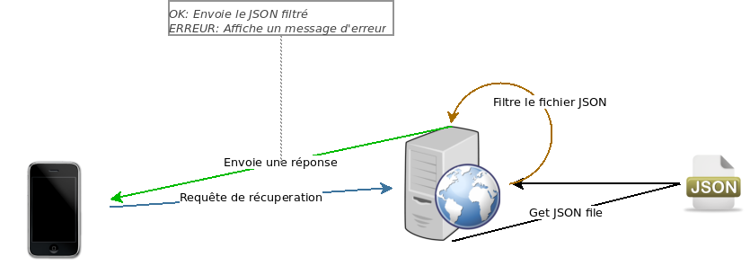
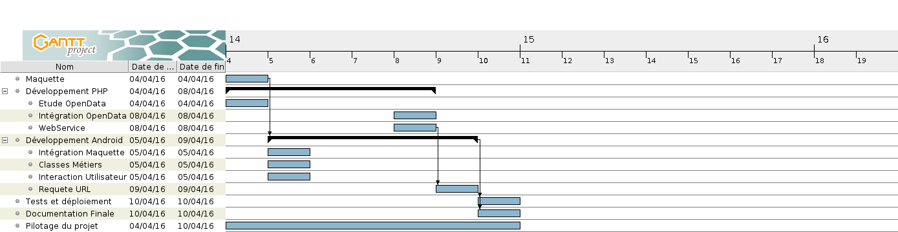
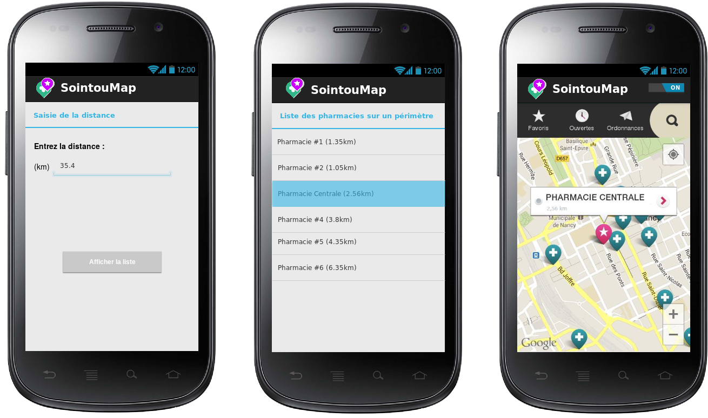

# TP Android - Sointou

## Context de la mission
Le laboratoire pharmaceutique Soigntou désire compléter la gamme d'outils numériques pour ses
représentants (délégué pharmaceutique). Il charge la société de services informatiques InfoSLAM de
développer un produit test sur Android et ce, concernant pour l'instant uniquement le département de
la Seine et Marne.


## Objectif du projet
Construire une application Android pour faciliter le démarchage des commerciaux du laboratoire
avec :
- La présentation en liste des pharmacies d'un département en fonction d'une distance saisie,
- La présentation des éléments d'informations pour une pharmacie choisie
- L’affichage sur une carte des officines suivant la distance afin de rationaliser le parcours du
représentant.

## Realisation et Analyse Technique

Il faudrat récuperer des informations JSON en ligne à partir de l'application android, il y aura donc du WebService avec une architecture REST.
De plus du coté PHP, il faudrat filtrer les informations récuperées depuis l'OpenData pour le bien de l'application, il faudrat donc afficher la nouvelle table JSON filtrée.



Nous afficherons le fichier json filtré de la manière suivante:
``` php
    <?php print($monNouveauJson) ; ?>
```

Si les données sont stockées dans un tableau php, nous fairons donc :

``` php
    <?php print(json_encode($monTableau)) ;?>
```

## Equipe
L'equipe est composée de :

- Schartier Isaac (Chef de projet - Développement Android)
- Doranges Mickael (Développement Php)

### Repartition des tâches
Voici un diagramme de Gantt concernant la gestion des tâches du projet.



## Application Android

L'application Android devra avoir les fonctionnalités suivantes :

- Première page: un widget propose l'entrée d'une distance (en km) et un bouton pour l'affichage en
liste des officines pharmaceutiques se situant dans le périmètre (deuxième page)

- Deuxième page : affichage de la liste des pharmacies avec le nom et la distance ; cette liste dispose
d'un écouteur (listener) permettant l'affichage de tous les renseignements liés a la pharmacie choisie
par l'utilisateur

- Troisième page: autonome, celle-ci se lance par un menu situe dans la deuxième page et ouvre une
carte Google Map avec deux tags, la position de l'utilisateur et celle des pharmacies de la liste du
périmètre.

### API Google Map
Une Google Map sera donc nécessaire aux fonctionnement de l'application, il faudrat utiliser l'API Google Map. Pour l'activer, il est obligatoire de préciser dans le AndroidManifest.xml la permission et la clé de l'API.

``` xml
  <!-- Permissions -->
  <permission
    android:name="com.example.googlemaps.permission.MAPS_RECEIVE"
    android:protectionLevel="signature" />

  <!-- La clé API -->
  <meta-data
    android:name="com.google.android.maps.v2.API_KEY"
    android:value="laCleDeAPI" />
```

### Maquette (0.1)

